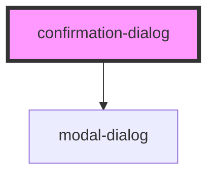

# confirmation-dialog

<!-- Auto Generated Below -->

## Properties

| Property       | Attribute       | Description | Type      | Default                          |
| -------------- | --------------- | ----------- | --------- | -------------------------------- |
| `cancelLabel`  | `cancel-label`  |             | `string`  | `'Cancel'`                       |
| `confirmLabel` | `confirm-label` |             | `string`  | `'Delete'`                       |
| `heading`      | `heading`       |             | `string`  | `'Are you sure?'`                |
| `message`      | `message`       |             | `string`  | `'This action cannot be undone'` |
| `open`         | `open`          |             | `boolean` | `false`                          |

## Events

| Event     | Description | Type                |
| --------- | ----------- | ------------------- |
| `cancel`  |             | `CustomEvent<void>` |
| `confirm` |             | `CustomEvent<void>` |

## Dependencies

### Depends on

- [modal-dialog](../modal-dialog)

### Graph

----------------------------------------------

*Built with [StencilJS](https://stenciljs.com/)*
