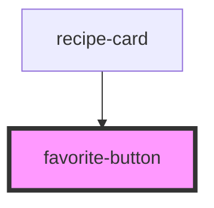

# favorite-button

<!-- Auto Generated Below -->

## Properties

| Property                | Attribute   | Description | Type                        | Default      |
| ----------------------- | ----------- | ----------- | --------------------------- | ------------ |
| `active`                | `active`    |             | `boolean`                   | `false`      |
| `disabled`              | `disabled`  |             | `boolean`                   | `false`      |
| `recipeId` _(required)_ | `recipe-id` |             | `string`                    | `undefined`  |
| `source`                | `source`    |             | `"community" \| "external"` | `'external'` |

## Events

| Event             | Description | Type                                |
| ----------------- | ----------- | ----------------------------------- |
| `favorite-toggle` |             | `CustomEvent<FavoriteToggleDetail>` |

## Dependencies

### Used by

 - [recipe-card](../recipe-card)

### Graph

----------------------------------------------

*Built with [StencilJS](https://stenciljs.com/)*
