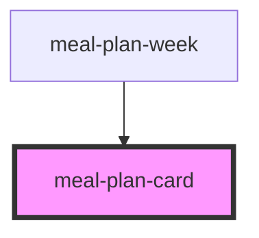

# meal-plan-card

<!-- Auto Generated Below -->

## Properties

| Property             | Attribute | Description | Type              | Default     |
| -------------------- | --------- | ----------- | ----------------- | ----------- |
| `entry` _(required)_ | --        |             | `UiMealPlanEntry` | `undefined` |

## Events

| Event         | Description | Type                           |
| ------------- | ----------- | ------------------------------ |
| `meal-edit`   |             | `CustomEvent<UiMealPlanEntry>` |
| `meal-remove` |             | `CustomEvent<UiMealPlanEntry>` |

## Dependencies

### Used by

 - [meal-plan-week](../meal-plan-week)

### Graph

----------------------------------------------

*Built with [StencilJS](https://stenciljs.com/)*
