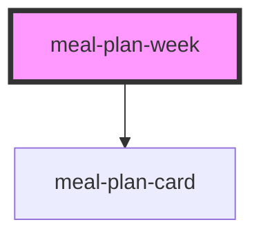

# meal-plan-week

<!-- Auto Generated Below -->

## Properties

| Property | Attribute | Description | Type                | Default                                                                          |
| -------- | --------- | ----------- | ------------------- | -------------------------------------------------------------------------------- |
| `meals`  | --        |             | `UiMealPlanEntry[]` | `[]`                                                                             |
| `week`   | --        |             | `string[]`          | `['Monday', 'Tuesday', 'Wednesday', 'Thursday', 'Friday', 'Saturday', 'Sunday']` |

## Events

| Event         | Description | Type                           |
| ------------- | ----------- | ------------------------------ |
| `meal-add`    |             | `CustomEvent<MealAddDetail>`   |
| `meal-edit`   |             | `CustomEvent<UiMealPlanEntry>` |
| `meal-remove` |             | `CustomEvent<UiMealPlanEntry>` |

## Dependencies

### Depends on

- [meal-plan-card](../meal-plan-card)

### Graph

----------------------------------------------

*Built with [StencilJS](https://stenciljs.com/)*
