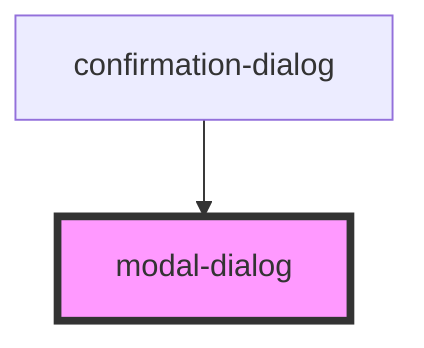

# modal-dialog

<!-- Auto Generated Below -->

## Properties

| Property | Attribute | Description | Type      | Default |
| -------- | --------- | ----------- | --------- | ------- |
| `open`   | `open`    |             | `boolean` | `false` |

## Events

| Event         | Description | Type                |
| ------------- | ----------- | ------------------- |
| `modal-close` |             | `CustomEvent<void>` |

## Slots

| Slot       | Description      |
| ---------- | ---------------- |
|            | The default slot |
| `"footer"` |                  |
| `"title"`  |                  |

## Dependencies

### Used by

 - [confirmation-dialog](../confirmation-dialog)

### Graph

----------------------------------------------

*Built with [StencilJS](https://stenciljs.com/)*
