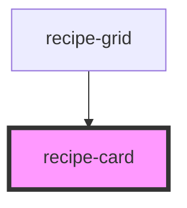

# recipe-card

<!-- Auto Generated Below -->

## Properties

| Property              | Attribute      | Description | Type              | Default     |
| --------------------- | -------------- | ----------- | ----------------- | ----------- |
| `favorite`            | `favorite`     |             | `boolean`         | `false`     |
| `recipe` _(required)_ | --             |             | `UiRecipeSummary` | `undefined` |
| `showActions`         | `show-actions` |             | `boolean`         | `false`     |
| `showAuthor`          | `show-author`  |             | `boolean`         | `true`      |

## Events

| Event             | Description | Type                                |
| ----------------- | ----------- | ----------------------------------- |
| `favorite-toggle` |             | `CustomEvent<FavoriteToggleDetail>` |
| `recipe-click`    |             | `CustomEvent<RecipeClickDetail>`    |
| `recipe-delete`   |             | `CustomEvent<RecipeClickDetail>`    |
| `recipe-edit`     |             | `CustomEvent<RecipeClickDetail>`    |

## Dependencies

### Used by

 - [recipe-grid](../recipe-grid)

### Graph

----------------------------------------------

*Built with [StencilJS](https://stenciljs.com/)*
