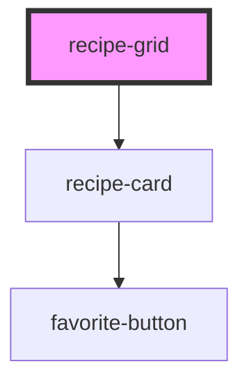

# recipe-grid

<!-- Auto Generated Below -->

## Properties

| Property       | Attribute       | Description                                             | Type                | Default                                   |
| -------------- | --------------- | ------------------------------------------------------- | ------------------- | ----------------------------------------- |
| `emptyMessage` | `empty-message` |                                                         | `string`            | `'Try adjusting your search or filters.'` |
| `favorites`    | --              | Set of "source:id" strings that are currently favorited | `string[]`          | `[]`                                      |
| `loading`      | `loading`       |                                                         | `boolean`           | `false`                                   |
| `recipes`      | --              |                                                         | `UiRecipeSummary[]` | `[]`                                      |
| `showActions`  | `show-actions`  |                                                         | `boolean`           | `false`                                   |

## Events

| Event             | Description | Type                                |
| ----------------- | ----------- | ----------------------------------- |
| `favorite-toggle` |             | `CustomEvent<FavoriteToggleDetail>` |
| `recipe-click`    |             | `CustomEvent<RecipeClickDetail>`    |
| `recipe-delete`   |             | `CustomEvent<RecipeClickDetail>`    |
| `recipe-edit`     |             | `CustomEvent<RecipeClickDetail>`    |

## Dependencies

### Depends on

- [recipe-card](../recipe-card)

### Graph

----------------------------------------------

*Built with [StencilJS](https://stenciljs.com/)*
